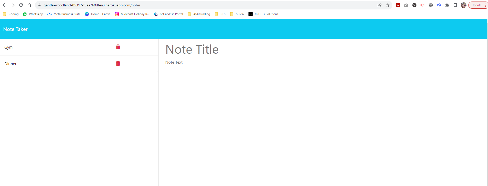

# Note-Taker-App

  

  ## Description
  The aim of the challenge was to create an Express.js back end that saves and retrieves note data from an existing JSON and link to the front end starter code. The result is a Note Taker application that saves, retrieves and deletes the users personal notes.
  Link to deployed Heroku page: (https://gentle-woodland-85317-f5aa760dfea3.herokuapp.com/)

  ## Table of Contents
  * [Description](#description)
  * [Installation](#installation)
  * [Usage](#usage)
  * [Licenses](#licenses)
  * [Contributing](#how-to-contribute)
  * [Tests](#tests)
  * [Questions/Contact Info](#questionscontacts)
  * [Credits](#credits)

  ## Installation
  The user should clone the code from this GitHub repository and download the required dependancies via npm install.

  ## Usage
  Screenshots and a GIF demonstration of the application are below. 
   
   

  ## Licenses
  This project is covered under the MIT license.
  To learn more about what this means, click the license button at the top.

  ## How to contribute
  Please get in touch via the details below to discuss third party contributions.

  ## Tests
  N/A

  ## Questions/Contacts
  Have questions about this project?  
  GitHub: https://github.com/Petarlo  
  Email: petaswan986@gmail.com

  ## Credits
  N/A
